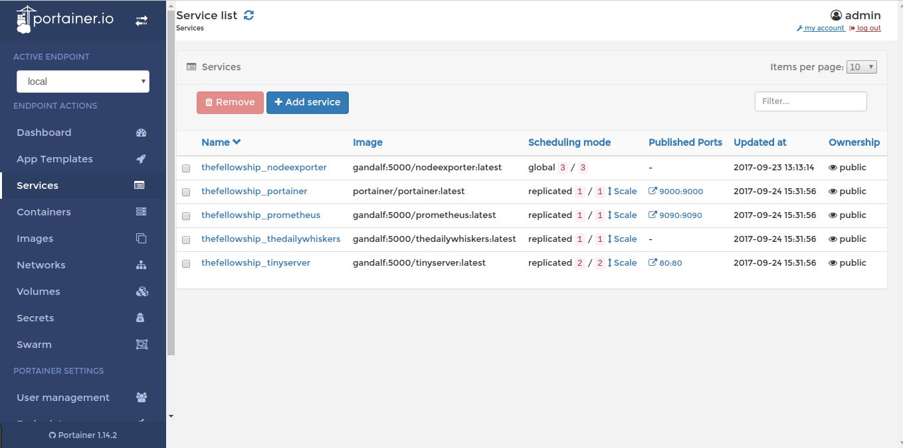
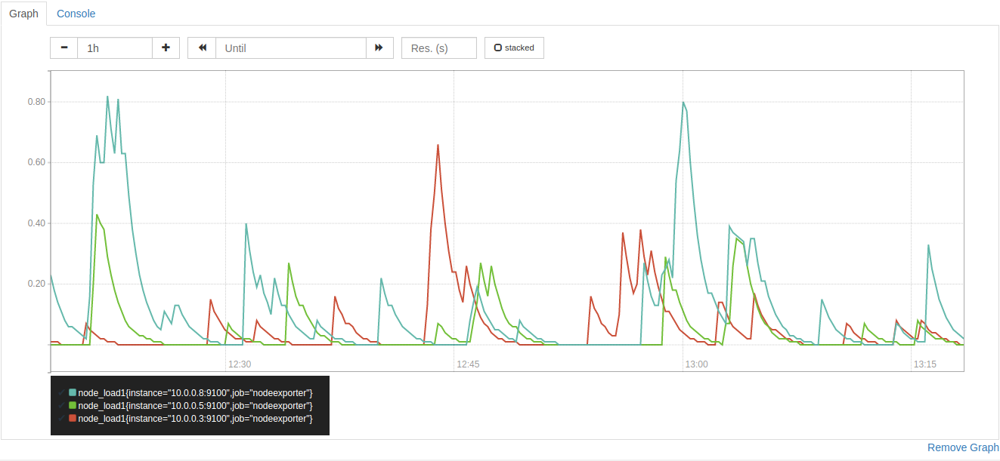

 Docker Swarm on Raspberry Pis 
=============================

Instructions on how to run [Docker](https://docker.com) [Swarm](https://docs.docker.com/engine/swarm/) on a cluster of [Raspberry Pis](https://www.raspberrypi.org/).  Covers the necessary components, setting up Docker, setting up Docker Swarm, and deploying some apps on your swarm.

Docker on Raspberry Pi's has been done many many times [before](https://medium.com/@bossjones/how-i-setup-a-raspberry-pi-3-cluster-using-the-new-docker-swarm-mode-in-29-minutes-aa0e4f3b1768), and this explanation won't cover anything new, except maybe the explanation of setting up Swarm mode which I didn't find anywhere else.  Other differences are, for example, I don't use Hypriots very useful [pre-built raspberry pi image which contains docker](http://blog.hypriot.com/downloads/).  A purely masochistic choice - I wanted to learn how to do it myself.

#  Hardware #


It feels odd to start with this section, given that I actually did this last - I first used two old pis I had hanging around before I went out and bought all this kit (including one of the older models with 256MB, which caused plently of problems due to being a bit underpowered).

Components list:

* Raspberry Pis, as many as you want.
* SD card for each Raspberry Pi, 8Gb is enough.
* 5V power supply, or powered USB hub, with 2.5A for each Raspberry Pi.
* Ethernet Switch & Cables, maybe a crimper if you want to make your own cables.
* Case of some description.

##  Power ##

Every other article I've read recommends that you power your cluster with a high powered USB hub.  And it does need to be pretty high powered - according to the Raspberry Pi official docs, you should have [at least 2.5A per Pi](https://www.raspberrypi.org/documentation/hardware/raspberrypi/power/README.md) - which does seem like a lot, but I haven't personally measured it.

I had a a power supply hanging around which could supply 10A at 5V I've used that instead, given that I only needed to drive 4 Pis, that's easily enough.  The [USB power specification](http://www.usb.org/developers/docs/) is quite complex - there are lots of rules about how a power supply should indicate that it can supply a certain voltage.  For example, the default is that the power supply will only promise 500mA, but if you tie together the two USB data pins then that means a promise of 1.5A.

Fortunately, a glance at the [Raspberry Pi schematic](https://www.raspberrypi.org/documentation/hardware/raspberrypi/schematics/Raspberry-Pi-3B-V1.2-Schematics.pdf), shows that the Pi completely ignores the two data pins, so we can ignore them as well, and simply wire the power supply straight into the the micro usb port.  It goes without saying that you shouldn't wire the power supply to the +5V / Gnd breakout pins, as these do not regulate the voltage.

#  Software #

##  Base Image ##

There are plenty of Raspberry Pi images available which contain the docker host pre-installed, for example [from Hypriot](http://blog.hypriot.com/downloads/).  I went for building my own though, because, well, why not.  Using the [Raspbian lite image](https://www.raspberrypi.org/downloads/raspbian/) as a base works fine.

It's probably a good idea to set up a static IP for your new raspberry pi as well, otherwise it will make the next stages much more difficult.

##  Docker Engine ##

Install Docker Engine: `curl -sSL https://get.docker.com | sh`

Setting up TLS certs to secure a remote connection to docker is the next step and you can do so by following [Docker's official advice](https://docs.docker.com/engine/security/https/#create-a-ca-server-and-client-keys-with-openssl).  Without TLS certs, anyone with access to the right port on your docker host will have complete control over it.  If you decide that's OK, and it probably isn't, then in the stop below, omit all the lines from `daemon.json` which start with `tls`.

Allow connecting to the docker daemon remotely:

* Edit `/etc/systemd/system/multi-user.target.wants/docker.service` to remove the `-H` flag from the `ExecStart` line (otherwise this will override the changes made below).
* Edit `/etc/docker/daemon.json` to look like:
	```
	{
	 "hosts": ["tcp://0.0.0.0:2376", "fd://"],
	 "tls": true,
	 "tlsverify": true,
	 "tlscacert": "<cert path>/ca.pem",
	 "tlscert": "<cert path>/server-cert.pem",
	 "tlskey": "<cert path>/server-key.pem"
	}
	```
* Restart Docker: `sudo systemctl daemon-reload && sudo systemctl restart docker`.

To set up more docker hosts, for example for worker nodes in a swarm, follow the instructions again, but reuse the CA certs from the first time.

##  Start a Swarm ##

This bit is absurdly easy.

First pick a node on which you want to start your swarm, this will be the first manager node.  Remember that the manager nodes are the ones which maintain the swarm state.  For more about Docker swarm, [rtfm](https://docs.docker.com/engine/swarm/key-concepts/).

From the manager node: `docker swarm init --advertise-addr <manager ip>`.  This will print the necessary command to run on your worker node in order to join the swarm - so run it on the worker and you're good to go.  That's literally it.

##   Deploy a Stack

Unlike when running a single docker host, when you run a swarm, you need somewhere to host all your Docker images before they are deployed to the swarm.  This place is a [Docker Registry](https://docs.docker.com/registry/).  On the x86_64 architecture, there is an official image for that, but not for arm, so I've made by own, see the Registry folder.

You must first build the arm binary and start the registry.  From the `Registry` directory, making sure that docker is pointing at your Raspberry Pi host:

```
./build.sh && docker-compose up -d --build
```
You may need to install the dependencies first, on Ubuntu these are: `golang-go`, `golang-go-linux-arm`.

Now, you can deploy a stack!  If you like, you can deploy the stack in this repository.  You will need to modify `docker-compose.yml` to update the IP addresses in the `image` sections to the IP address of your new registry above.  Seems odd to me that there is no way of doing this with templating, but never mind.

So, to deploy the stack in this repository.  Install `upx` (`apt install upx` on Ubuntu) and run `build.sh` in the `NodeExporter` directory, then:
```
docker-compose build  # Build all images
docker-compose push   # Push all images to my local registry
docker stack deploy --compose-file docker-compose.yml <stack name> --prune
```

This is obviously not designed to be a best practise guide on deploying stacks, just a way to get it up and running.  [This is a best practise guide](https://success.docker.com/Architecture/Docker_Reference_Architecture%3A_Development_Pipeline_Best_Practices_Using_Docker_EE).

#  Services

As mentioned before, if you run docker on a x86_64 machine, then you'll find that there are an enourmous number of official images which you can use.  For arm, which is what a Raspberry Pi is, there are fewer.  This means that we get to build a lot of our images from scratch.  The source code in this repository contains the means to build the following Raspberry Pi images:

* [Prometheus](https://prometheus.io/) - For monitoring and alerting of other services
* Prometheus' [NodeExporter](https://github.com/prometheus/node_exporter) - For monitoring data about the underlying host to prometheus, eg. CPU and memory usage.
* Tiny server built from httpd on [Busybox](https://www.busybox.net/).

My cluster also runs:

* [Portainer](https://github.com/portainer/portainer) - a rather beautiful management UI for Docker.
* [TheDailyWhiskers](https://github.com/SimonStJG/TheDailyWhiskers) - A silly little app which emails you pictures of cats.

Here's an image of these services running, from Portainer:



##  Monitoring with Prometheus

[Prometheus](https://prometheus.io/) is a monitoring and alerting system.  It's essentially a big time series database, with a query language for inspecting the data, and an alerting system for notifying you if somethings up.  The Prometheus server scrapes a predefined list of targets (possibly found via some sort of service discovery).

Here's a nice picture of the one minute load average with three nodes, as you can see they are not working very hard (there are 4 available CPUs on each node).



Prometheus can integrate into various services using client libraries.  For example, if you look at the code for my silly python app [TheDailyWhiskers](https://github.com/SimonStJG/TheDailyWhiskers), you can see it integrated there (there is probably < 50 lines of code in the whole app, so pretty easy to see what's going on).

Prometheus provide a service to expose metrics about the underlying host machine, eg. CPU and memory usage, disk IO, etc.  This service is called the Node Exporer.  The Node Exporter is also written in [Go](https://golang.org/) which makes it a pleasure to cross-compile and run on the Raspberry Pi - Go binaries contain all their static dependencies, so you can dump them in an otherwise empty Docker image and they will mostly just work.  Look at the example Dockerfile in the NodeExporter directory in this repo to see how easy this is.  This isn't the recommended way to set up the NodeExporter (for good reason, see https://github.com/prometheus/node_exporter for more of an explanation), but this was an experiment to set up docker, not to follow all the best practises.

### Auto-detecting nodes

In version 3.3 of the compose file, Docker introduced [DNS round-robin endpoints](https://docs.docker.com/compose/compose-file/#endpoint_mode).  Any DNS request to an endpoint in round-robin mode will return the IP off all the tasks running this service.  For example, let's say I have a NodeExporter running on every swarm node, then a dns request for NodeExporter will return the IP addresses of all the NodeExporters.  The default endpoint mode is to expose a single virtual IP address.

We can use this  round-robin feature along with Prometheus' DNS service discovery configuration to automatically scrape new nodes when they are added to the swarm.  For more on this, see `Prometheus/prmometheus.yml` and the `NodeExporter` section of `docker-compose.yml`.

##  Tiny Server with Busybox

[Busybox](https://www.busybox.net/) is a bit of Software that provides lots and lots of unix tools, including a shell, and _httpd_ - a webserver.  Since it's an absolutely miniscule <5Mb, it's a nice way to create a tiny webserver.

This is inspired by Hypriot's version [hypriot/rpi-busybox-httpd](https://github.com/hypriot/rpi-busybox-httpd).  Actually, who am I kidding, it is Hypriot's idea exactly, but I have chosen not to use dockerize to build it, nor a go makefile, and obviously I've put my own webpage in there.  There's a [great video](https://blog.docker.com/2015/09/update-raspberry-pi-dockercon-challenge/)
of hypriot starting hundreds of these rpi-busybox-httpd containers on a
single Docker host on a Raspberry Pi.

# Attribution #

* Regitry based on https://github.com/cblomart/rpi-registry (MIT licence).
* Tiny Server with Busybox based on https://github.com/hypriot/rpi-busybox-httpd (MIT Licence).
* Crane and Terminal icons by [flaticon](https://www.flaticon.com).
* Hardware Icon made by [Maxim Basinski](https://www.flaticon.com/authors/maxim-basinski) from [Flaticon](https://www.flaticon.com)  is licensed by [Creative Commons BY 3.0](http://creativecommons.org/licenses/by/3.0/").
